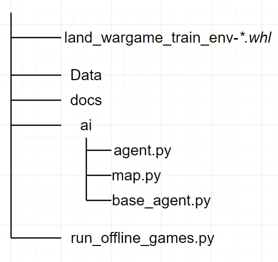

# SDK安装

> 来源: https://wargame.ia.ac.cn/docs/reference/install/

# SDK安装

## SDK运行环境

- 操作系统环境:
  - Ubuntu = 20.04
- Python解释器：
  - python = 3.10

## SDK下载

下载地址为: <http://wargame.ia.ac.cn/aidevelopment>。选择社区开发板下载。

## SDK结构说明

下载后的zip文件内结构如下：


- **land\_wargame\_train\_env-\*.whl**：SDK提供的环境安装包，用于安装核心模块
- **Data**：包含SDK可用的地图，想定数据
- **docs**：开发参考文档
- **run\_offline\_games.py**：推演启动入口程序，提供了环境和AI的使用示例。开发者通过修改本文件代码，可以import自己开发的agent，自由设置对抗的次数，逻辑等。
- **ai**：开发者需在SDK根目录下自己创建名为**ai**的Python package，并确保可以从此package中import到名为**Agent**的类，此类将在入口程序中被实例化来启动AI。公开的SDK已经为大家设置好正确的的结构，且在agent.py中内置了DemoAI。开发者可以参照公开的文件，类及结构，避免在在线上传AI时产生不必要的麻烦。
- **ai/base\_agent.py**：陆战兵棋AI基类。开发人员在编写自己的AI时，必须继承base\_agent，并实现其中的抽象方法。
- **ai/map.py**：为方便AI开发，SDK提供的地图相关基础函数工具（如寻路），供开发团队选用。
- **ai/agent.py：**SDk中自带的DemoAI，此AI会下达随即动作。开发者可以参考也可以完全重写。

## SDK安装

解压zip文件，在解压后文件所在文件夹下使用以下命令安装SDK。修改install的whl文件名为真实文件名。SDK会自行安装并安装其依赖库。

```
pip install land_wargame_train_env-*.whl
```

随后对Data.zip文件进行原地解压：

```
unzip Data.zip
```

## 测试安装

在终端执行以下命令。

```
python run_offline_games.py
```

终端应输出SDK版本号等其他信息并无报错，程序应该在1分钟内运行完毕，并生成复盘文件在<*project\_root>*/logs/replays\_。