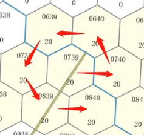

# SDK中包含的其他工具和算法

> 来源: https://wargame.ia.ac.cn/docs/reference/map/

# SDK中包含的其他工具和算法

Warning

SDK自5.0.0版本以来，运行不在依赖see.npz文件。环境初始化时，see\_data参数可传入None。Map类实例化仍需要see.npz，开发者需注意。

AI开发者可以自行使用AI开发SDK中自带的公开辅助工具类和算法。

## **`Map`类**

为方便AI开发，平台将相关公开地图基础函数工具放置于`ai/map.py`中，开发者可以在自己的agent中使用其中`Map`类加载地图数据，并使用其提供的一些开放接口获得地图基础数据相关信息。

```
from ai.map import Map
map = Map(
    setup_info["basic_data"],
    setup_info["cost_data"],
    setup_info["see_data"]
)
```

### **`Map.gen_move_route(coord1, coord2, mod) -> list[int]`**

**功能：**计算给定出发点和目标点的路径

**参数说明：**

| 参数名 | 数据类型 | 说明 |
| --- | --- | --- |
| `coord1` | `int` | 出发点坐标 |
| `coord2` | `int` | 目标点坐标 |
| `mod` | `int` | 机动模式：0-车辆机动，1-车辆行军，2-步兵机动，3-空中单位机动 |

**返回值：**机动路径list[int]

| 返回值名 | 数据类型 | 说明 |
| --- | --- | --- |
| `route` | `list[int]` | 一个连续的路径 |

### **`Map.can_see(coord1, coord2, mod) -> bool`**

**功能：**判断两点之间是否通视

**参数说明：**

| 参数名 | 数据类型 | 说明 |
| --- | --- | --- |
| `coord1` | `int` | 观察点坐标 |
| `coord2` | `int` | 目标点坐标 |
| `mod` | `int` | 观察模式： 0-地对地（0m对0m 1-低空对低空（200m对200m） 2-低空对地（200m对0m） 3-超低地对空（20m对0m） 4-超低空对超低空（20m对20m） 5-低空对超低空（200m对20m） 6-高空对地（500m对0m） 7-高空对超低空（500m对20m） 8-高空对低空（500m对200m） 9-高空对高空（500m对500m） |

**返回值：**

| 返回值 | 数据类型 | 说明 |
| --- | --- | --- |
| `can_see` | `bool` | 是否通视 |

### **`Map.get_distance(coord1, coord2) -> int`**

**功能：**计算两点之间的距离

**参数说明：**

| 参数名 | 数据类型 | 说明 |
| --- | --- | --- |
| `coord1` | `int` | 出发点坐标 |
| `coord2` | `int` | 目标点坐标 |

**返回值：**

| 返回值 | 数据类型 | 说明 |
| --- | --- | --- |
| `dis` | `int` | 两点之间距离 |

### **`Map.get_neighbors(coord) -> list[int]`**

**功能：**获取指定位置的邻域

**参数说明：**

| 参数名 | 数据类型 | 说明 |
| --- | --- | --- |
| `coord` | `int` | 指定位置坐标 |

**返回值：**

| 返回值 | 数据类型 | 说明 |
| --- | --- | --- |
| `neighbors` | `list[int]` | 相邻六格的坐标数组，如果超出地图范围则填-1 |

### **`Map.get_map_data() -> list[dict]`**

**功能：**返回地图数据，包含坐标、地形、地势、相邻六角格坐标、与相邻六角格相连的道路类型、与相邻六角格间是否有河流。

**返回值：**

| 参数名 | 数据类型 | 说明 |
| --- | --- | --- |
| `map_data` | `List[dict]` | 存储地图数据(dict)的二维列表，第一维表示纵坐标，第二维表示横坐标，具体字典结构见[地图数据](#mapdata) |

Info

地图数据中保存领域坐标数据顺序为右边的坐标开始，以逆时针的方向顺序存储数据，例如坐标0739的地图数据中，其相邻坐标应为[740, 640 , 639, 738, 839, 840]，如下图所示：



地图邻域数据保存顺序

### **`Map.is_valid(pos) -> bool`**

**功能：**判断坐标是否在地图范围内

**参数说明：**

| 参数名 | 数据类型 | 说明 |
| --- | --- | --- |
| `pos` | `int` | 指定位置坐标 |

**返回值：**bool, 1-合法，0-不合法

| 参数名 | 数据类型 | 说明 |
| --- | --- | --- |
| `valid` | `bool` | 是否合法 |

### **`Map.get_grid_distance(center, distance_start, distance_end) -> set`**

**功能：**计算距离圆心，距离在distance\_start和distance\_end之间的所有六角格的坐标

**参数说明：**

| 参数名 | 数据类型 | 说明 |
| --- | --- | --- |
| `center` | `int` | 圆心 |
| `distance_start` | `int` | 距离起点 |
| `distance_end` | `int` | 距离终点 |

**返回值：**

| 参数名 | 数据类型 | 说明 |
| --- | --- | --- |
| `grid` | `set` | 符合条件的所有六角格坐标的set |

## **地图数据**

地图数据总共由三部分组成，`basic.json`是基础地图数据，`cost.pickle`为机动成本数据，`see.npz`为通视数据。环境和agent均需要这些数据完成初始化。在`ai/map.py`中有为AI开发便利而开放的地图数据接口，使agent方能够得到一局推演中的地图数据。agent开发者可通过开放接口来使用地图数据，也可以自行读取地图数据源文件，自行使用数据。

### **基础数据`basic.json`**

```
{
    "ele_grade": "高程 int",
    "map_data": [
        [
            {
                "elev": "高程 int",
                "cond": "地形 int 0-开阔地 1-从林地 2-居民地 3-松软地 4-大河流 5-路障",
                "roads": "六个方向上道路类型 0-无 1-黑色 2-红色 3-黄色 list",
                "rivers": "六个方向上河流 0-无 1-有 list ",
                "neighbors": "六个方向上邻域坐标 list"
           }
        ]
    ]
}
```

### **通行代价`cost.pickle`**

三维`list`,存放不同通行模式下到邻域的通行代价

```
[
    [
        [
            { "能通行的邻域坐标 int " : "通行代价 int" }
        ]
    ]
]
```

- 第一维索引: 通行方式, 取值范围[0-车辆机动, 1-车辆行军, 2-步兵机动, 3-空中机动]
- 第二维索引: 地图行坐标 取值范围[0, max\_row)
- 第三维索引: 地图列坐标 取值范围[0, max\_col)
- 元素: 到邻域的通行代价,通行代价定义为当前通行模式下最大机动速度/当前速度

### **通视数据`see.npz`**

储存预计算好的通视数据。五维数组，表示以某种模式的两点之间是否通视的`int`, `0`代表不同时，`1`代表通视。

```
[
    [
        [
            [
                [
                    "0 or 1"
                ]
            ]
        ]
    ]
]
```

- 第一维索引：
  - 0：地对地模式
  - 1：低空对低空模式
  - 2：低空对地模式
  - 3：超低空对地
  - 4：超低空对超低空
  - 5：低空对超低空
  - 6：高空对地
  - 7：高空对超低空
  - 8：高空对低空
  - 9：高空对高空
- 第二维索引：第一点的行坐标
- 第三维索引：第一点的列坐标
- 第四维索引：第二点的行坐标
- 第五维索引：第二点的列坐标