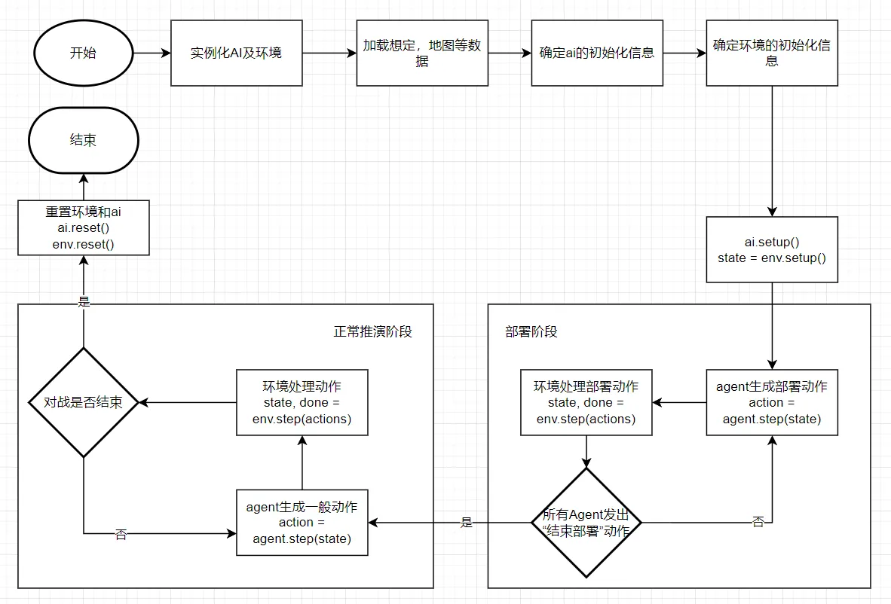

# 环境使用

> 来源: https://wargame.ia.ac.cn/docs/reference/usage/

# 环境使用

主要介绍下载的SDK中的兵棋环境在本地使用的方法和流程

## **环境本地使用流程**

本地单机通过运行根目录下run\_offline\_games.py脚本启动引擎和本地Demo agent对抗。
agent生成动作后，env调用step接收双方的动作，并生成下一步的state以及done。state[RED]为红方态势，state[BLUE]是蓝方态势，state[GREEN]是包含了蓝方和红方的全局态势数据，在全局态势中，双方所有的算子信息全部可见。

在本地推演对战的实际过程中，开发人员对态势信息（state）和动作信息（actions）的内容和流动有完全的获取，修改，控制权；态势，数据和动作数据的具体格式参照[态势数据说明](../observations/)以及[动作](../actions/)。但是在线上网络对抗中，agent只能获得由对抗引擎发送的本方态势信息，env也只能接收到参加本次推演的agent产生的动作信息。



### **环境使用流程代码示例**

在run\_offline\_game.py文件中运行以下代码：

```
import time
from train_env import TrainEnv
from ai.agent import Agent # 开发者编写好的AI类

def main():
    """
    run demo in single agent mode
    """
    print("running in single agent mode...")
    # instantiate agents and env
    red1 = Agent()
    blue1 = Agent()
    env1 = TrainEnv()
    begin = time.time()

    # get data ready, data can from files, webs, or another source
    with open("data/scenarios/333.json") as f:
        scenario_data = json.load(f)
    with open("data/maps/333/333_basic.json") as f:
        basic_data = json.load(f)
    with open('data/maps/333/333_cost.pickle', 'rb') as file:
        cost_data = pickle.load(file)
    see_data = numpy.load("data/maps/333/333_see.npz")['data']

    # player setup info
    player_info = [{
        "seat": 1,
        "faction": 0,
        "role": 0,
        "user_name": "demo",
        "user_id": 0
    },
    {
        "seat": 11,
        "faction": 1,
        "role": 0,
        "user_name": "demo",
        "user_id": 0
    }]

    # env setup info
    env_step_info = {
        "scenario_data": scenario_data,
        "basic_data": basic_data,
        "cost_data": cost_data,
        "see_data": see_data,
        "player_info": player_info
    }

    # setup env
    state = env1.setup(env_step_info)
    print("Environment is ready.")

    # setup ai
    red1.setup(
        {
            "scenario": scenario_data,
            "basic_data": basic_data,
            "cost_data": cost_data,
            "see_data": see_data,
            "seat": 1,
            "faction": 0,
            "role": 0,
            "user_name": "demo",
            "user_id": 0,
            "state": state,
        }
    )
    blue1.setup(
        {
            "scenario": scenario_data,
            "basic_data": basic_data,
            "cost_data": cost_data,
            "see_data": see_data,
            "seat": 11,
            "faction": 1,
            "role": 0,
            "user_name": "demo",
            "user_id": 0,
            "state": state,
        }
    )
    print("agents are ready.")

    # loop until the end of game
    print("steping")
    done = False
    while not done:
        actions = []
        actions += red1.step(state[RED])
        actions += blue1.step(state[BLUE])
        state, done = env1.step(actions)
        all_states.append(state[GREEN])

    env1.reset()
    red1.reset()
    blue1.reset()

    print(f"Total time: {time.time() - begin:.3f}s")


if __name__ == "__main__":
    main()
```

## **关于单/多agent模式的说明**

### **单agent模式**

单agent模式指的是，一局游戏中，单方阵营内只有**1**个agent实例。此agent实例拥有操作本方阵营所有算子的权利。并且不会和其他agent发生信息交互。
此模式下的通常对抗场景有：

- ***1* × 人类队长** vs. ***1* × agent**
- ***1* × 人类队长 + *i* × 人类队员** vs. ***1* × agent**

通常情况下0 <= ***i*** <= 4

### **多agent模式**

多agent模式指的是，在一局游戏中，任一方中有**多**个agent实例构成，比如一方阵营中1个队长，2个人类队员，和2个agent队员。
队长可以下达更多的动作，包括兵力编组，下达战斗任务等队长专属动作；而队员只可以下达一般动作。

每个agent和人类只控制**部分**算子，并接收队长下达的任务。
在此模式下，agent实例之间存在潜在的信息上的交互。

此模式的通常对战用例有：

- ***1* × 人类队长 + *i* × 人类队员 + *j* × agent** vs**. *1* × 人类队长 + *m* × 人类队员 + *n* × agent**

通常情况下0 <= ***j***, ***n*** <= 5，0 <= ***j***+***n*** <= 5

### **单agent模式下的环境使用流程代码示例**

在/run\_offline\_game.py文件中运行以下代码：

```
import time
from train_env import TrainEnv
from ai1.agent import Agent as LianAgent
from ai2.agent import Agent as YingAgent


def main():
    """
    run demo in single agent mode
    """
    print("running in single agent mode...")
    # instantiate agents and env

# 多agent模式下的环境使用流程代码示例
在/run_offline_game.py文件中运行以下代码：
```python linenums="1"
import time
from train_env import TrainEnv
from ai1.agent import Agent as LianAgent
from ai2.agent import Agent as YingAgent


def main():
    """
    run demo in multi agent mode
    """
    print("running in multi agent mode...")
    # instantiate agents and env
    red1 = LianAgent()
    red2 = YingAgent()
    red3 = YingAgent()
    blue1 = LianAgent()
    blue2 = YingAgent()
    blue3 = YingAgent()
    env1 = TrainEnv()
    begin = time.time()

    # get data ready, data can from files, web, or any other sources
    with open("data/scenarios/333.json") as f:
        scenario_data = json.load(f)
    with open("data/maps/333/333_basic.json") as f:
        basic_data = json.load(f)
    with open('data/maps/333/333_cost.pickle', 'rb') as file:
        cost_data = pickle.load(file)
    see_data = numpy.load("data/maps/333/333_see.npz")['data']

    # player setup info
    player_info = [{
        "seat": 1,
        "faction": 0,
        "role": 1,
        "user_name": "red1",
        "user_id": 1
    },
    {
        "seat": 2,
        "faction": 0,
        "role": 0,
        "user_name": "red2",
        "user_id": 2
    },
    {
        "seat": 3,
        "faction": 0,
        "role": 0,
        "user_name": "red3",
        "user_id": 3
    },
    {
        "seat": 11,
        "faction": 1,
        "role": 1,
        "user_name": "blue1",
        "user_id": 11
    },
    {
        "seat": 12,
        "faction": 1,
        "role": 0,
        "user_name": "blue2",
        "user_id": 12
    },
    {
        "seat": 13,
        "faction": 1,
        "role": 0,
        "user_name": "blue3",
        "user_id": 13
    }]

    # env setup info
    env_step_info = {
        "scenario_data": scenario_data,
        "basic_data": basic_data,
        "cost_data": cost_data,
        "see_data": see_data,
        "player_info": player_info
    }

    # setup env
    state = env1.setup(env_step_info)
    all_states.append(state[GREEN])
    print("Environment is ready.")

    # setup AIs
    red1.setup(
        {
            "scenario": scenario_data,
            "basic_data": basic_data,
            "cost_data": cost_data,
            "see_data": see_data,
            "seat": 1,
            "faction": 0,
            "role": 1,
            "user_name": "red1",
            "user_id": 1,
            "state": state,
        }
    )
    red2.setup(
        {
            "scenario": scenario_data,
            "basic_data": basic_data,
            "cost_data": cost_data,
            "see_data": see_data,
            "seat": 2,
            "faction": 0,
            "role": 0,
            "user_name": "red2",
            "user_id": 2,
            "state": state,
        }
    )
    red3.setup(
        {
            "scenario": scenario_data,
            "basic_data": basic_data,
            "cost_data": cost_data,
            "see_data": see_data,
            "seat": 3,
            "faction": 0,
            "role": 0,
            "user_name": "red3",
            "user_id": 3,
            "state": state,
        }
    )
    blue1.setup(
        {
            "scenario": scenario_data,
            "basic_data": basic_data,
            "cost_data": cost_data,
            "see_data": see_data,
            "seat": 11,
            "faction": 1,
            "role": 1,
            "user_name": "blue1",
            "user_id": 11,
            "state": state,
        }
    )
    blue2.setup(
        {
            "scenario": scenario_data,
            "basic_data": basic_data,
            "cost_data": cost_data,
            "see_data": see_data,
            "seat": 12,
            "faction": 1,
            "role": 0,
            "user_name": "blue2",
            "user_id": 12,
            "state": state,
        }
    )
    blue3.setup(
        {
            "scenario": scenario_data,
            "basic_data": basic_data,
            "cost_data": cost_data,
            "see_data": see_data,
            "seat": 13,
            "faction": 1,
            "role": 0,
            "user_name": "blue3",
            "user_id": 13,
            "state": state,
        }
    )
    print("agents are ready.")

    # loop until the end of game
    print("steping")
    done = False
    while not done:
        actions = []
        actions += red1.step(state[RED])
        actions += red2.step(state[RED])
        actions += red3.step(state[RED])
        actions += blue1.step(state[BLUE])
        actions += blue2.step(state[BLUE])
        actions += blue3.step(state[BLUE])
        state, done = env1.step(actions)
        all_states.append(state[GREEN])

    env1.reset()
    red1.reset()
    red2.reset()
    red3.reset()
    blue1.reset()
    blue2.reset()
    blue3.reset()

    print(f"Total time: {time.time() - begin:.3f}s")

if __name__ == "__main__":
    main()
```