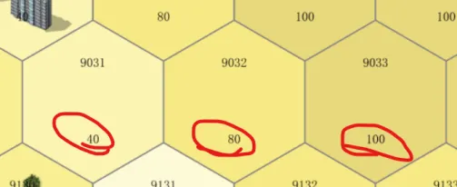
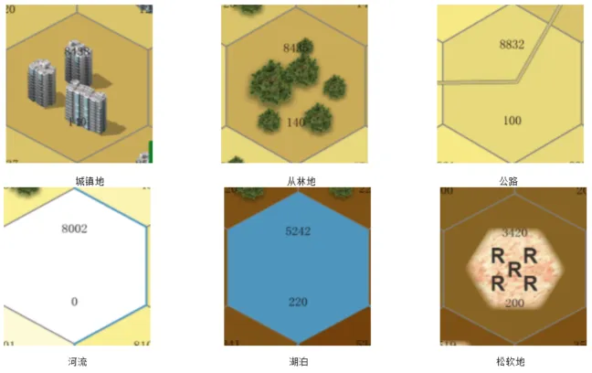
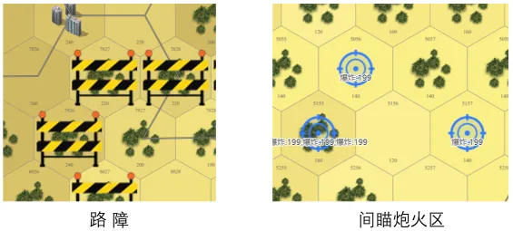
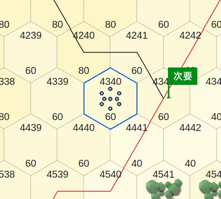
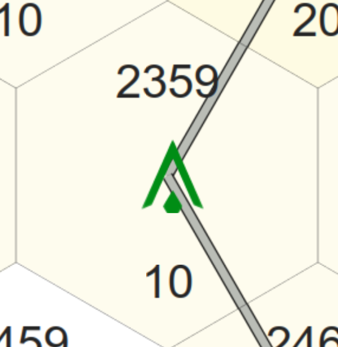
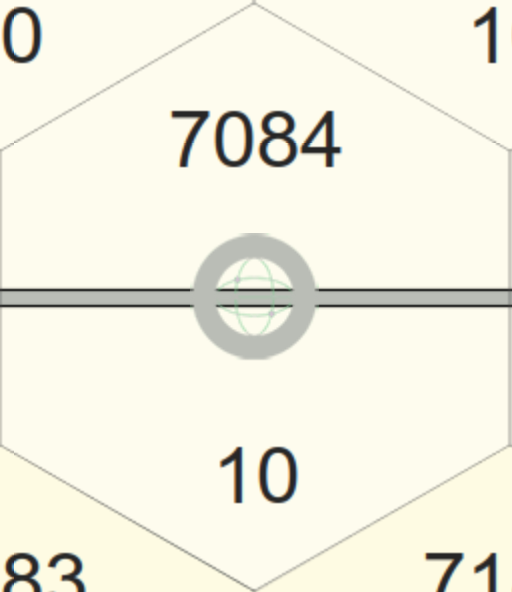
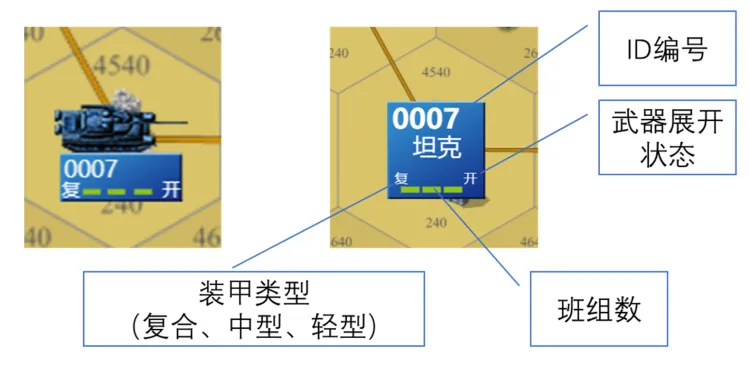

# 兵棋要素

> 来源: https://wargame.ia.ac.cn/docs/rules/elements/

# **兵棋要素**

## **地图和地形量化**

### **高程**

高程代表所在位置的相对地图中最低点的相对高度，在六角格上用颜色和数字标识，颜色越深高度越高，数字则对应具体的高程值。

高程是陆战兵棋地形的重要属性，影响算子的机动、观察以及对火力打击产生影响：

- 机动：相邻两六角格，高差越大，所需机动值越多，机动速度越慢；
- 观察：地形的高低会产生对观察视野的遮挡，从而高地往往具有更开阔的视野，而低洼地带能够产生隐蔽的效果；
- 射击：通常来说从高处打低处会取得更好的对敌毁伤效果，反之则削弱对敌的毁伤。

### **地物**

地物是某区域地表的包括特殊地形特征，包括：居民地，从林地，水域，松软地，公路、铁路等等

地物特殊地形会对算子动作造成一定的影响，比如降低通行速度，改变被观察距离，降低打击效果等。
通常当车辆进入居民地、丛林地、松软地及水域机动速度将减缓，但当车辆是沿公路或铁路机动时，则不受高程、从林地、松软地等特殊地形对机动速度的影响；
车辆“行军”动作必须沿着公路线或铁路线才能实施（行军速度可达到普通机动速度的2倍）。

### **设施**

设施是为了达到对抗目的在某区域人工设置的条件，包括路障、间瞄炮火区、雷场等等

雷场

发射阵地

通信节点

- 路障：阻碍地面算子机动，地面算子（人员/车辆）无法通过设置有路障的区域。
- 间瞄炮火区：为间瞄炮兵算子下达间瞄火力且炮火到达的区域。地面算子进出炮火区将受到间瞄火力裁决，详见[间瞄射击规则](../rules/#jianmiaoguize)和[间瞄射击裁决表](../tables/#jianmiaobiao)
- 雷场：没有扫雷开辟通路功能的算子，也没有半速沿已开通路机动的算子，进入雷场后会受到雷场裁决，详见[雷场裁决表](../tables/#leichangbiao)
- 发射阵地：发射车可以执行发射任务的地点
- 通信节点：指挥车和通信车进行通信需要所处的位置

## **算子的表示**

陆地指挥官兵棋中一个算子代表一个排的聚合兵力，例如一个坦克排，可以由1~4辆坦克构成。
算子有模型图标和棋子图标两种形式，在算子图标上标注有信息，指示了一个算子的防御力（装甲类型）、血量（班组数），以及武器的状态等，如图。

