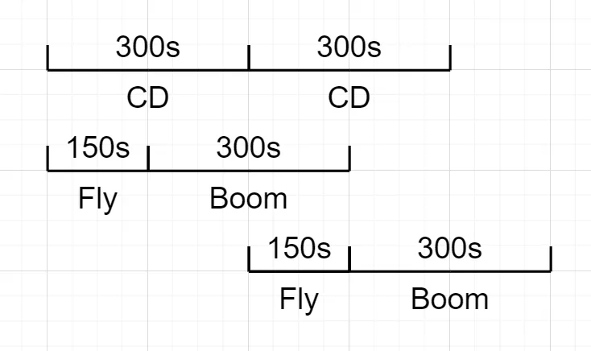

# 推演规则

> 来源: https://wargame.ia.ac.cn/docs/rules/rules/

# 推演规则

## 机动规则

1. 当棋子从一个六角格中心点机动至下一个相临六角格的中心点时，视为机动1格，以当前机动方式和下一个六角格的地形条件作为计算机动速度的依据。
2. 以棋子到达目标格的中心点作为后续机动或其他行动裁决的基准点，当棋子离开一个六角格的中心点后，在机动小于1格时射击或被射击等均以上一个六角格为裁决依据。
3. 机动指令一旦下达就不可更改，可以下达停止机动指令，停止机动指令下达后，当前机动指令未执行的部分不再执行，进入机动转停止阶段。
4. 机动状态有以下五种：正常机动，一级冲锋，二级冲锋，掩蔽，半速。以上状态之间互斥，算子在某一时刻只能处于一种状态之下。

### 机动停止

1. 地面棋子转换为停止状态需要75秒的“机动→停止”转换时间，空中棋子转为悬停状态需要75秒的“机动→悬停”转换时间。
2. 必须等待“机动→停止”转换完成后才能执行的命令有：车辆武器锁定、车辆武器展开、上下车、发射巡飞弹、步兵或战车直瞄/间瞄/引导射击、空中单位直瞄/间瞄/引导射击，等其他必须在静止状态下才能执行的动作。
3. 可以对机动中的棋子下达停止机动命令，收到停止机动命令后，棋子必须完成当前格的机动后，才能停止，棋子停止后即开始“机动→停止”转换。停止机动命令会导致75秒的惩罚性“机动→停止”转换，在这期间不能进行任何操作。
4. 地面算子在机动转停止过程中，可以进行改变机动状态（模式）的动作；包括切换至：正常机动，行军，一级冲锋，二级冲锋，掩蔽，半速；

### 车辆机动

1. 车辆在丛林地机动速度为正常速度的二分之一，居民地机动速度为正常速度的三分之一，小河流机动速度为正常速度的二分之一，大河流机动速度为正常速度的四分之一，松软地机动速度为正常速度的四分之一。
2. 地图的单位高程差表示六角格高度的最小变化值，一般分为5米，10米，20米
3. 地图的坡度等级是：两个六角格之间的高程差除以地图的单位高程差。一般分为1级坡度，2级坡度，3级坡度，4级坡度，5级坡度。1级坡度表示两个六角个之间的高程差等于1个单位高度差；2级坡度表示两个六角格之间的高程差等于2个单位高度差；3级坡度表示两个六角格之间的高度差等于3格单位高程差；依此类推。
4. 当车辆沿1级坡度地形机动时，按正常机动速度机动；当车辆在2级坡度地形机动时，按正常机动速度的1/2机动；当车辆在3级坡度地形机动时，按正常机动速度的1/3机动；依次类推；当坡度等级>5时，车辆无法进入并通过。
5. 当车辆沿道路以机动状态行驶时，速度不受地形和高差的影响。
6. 炮兵不能机动
7. 路障地形不可通过

### 车辆行军

1. 车辆在行军方式速度为乡村路（黑色线）40千米/小时，一般公路（红色线）60千米/小时，等级公路（黄色线）90千米/小时。
2. 车辆必需进入道路六角格后才可转换为行军状态，转换过程需要75秒等待时间；只能沿道路走向规划行军路线，行军状态下速度不受地形和高差的影响。
3. 车辆行军前需要先将武器锁定（75秒时间）。
4. 如下一格存在停止的棋子或者非行军的棋子，则行军被阻挡
5. 行军状态下，棋子不能射击，不能引导射击，不能上下车，不能发射巡飞弹，不能离开道路。
6. 车辆由机动状态转为行军状态，或者由行军状态转为停止行军均需要75秒时间。

### 人员机动

1. 人员机动速度不受地形影响。
2. 当高差＞60米时，人员速度降为正常机动速度的一半。
3. 人员可以切换到一级冲锋状态或二级冲锋状态：
   1. 一级冲锋：人员速度提高为原来的2倍，每冲锋1格增加一级疲劳。
   2. 二级冲锋：人员速度提高为原来的4倍，每冲锋1格增加一级疲劳。
   3. 一级疲劳状态下不能实施二级冲锋，二级疲劳状态下不能机动。
   4. 人员机动结束后，如果不继续机动，每75秒疲劳等级下降一级。
4. 人员机动或冲锋过程中如果遭到压制，立即转为被压制状态，在完成当前格的机动后自动停止，直到秒后压制自动解除后才能继续执行未完成的机动或冲锋命令。
5. 人员转为冲锋状态后，只要不转为正常机动状态，就始终处于冲锋状态。
6. 路障地形可以通过

## 上下车规则

1. 上车单位与车辆位于同一格，且上车单位与车辆均处于停止状态，可执行上下车命令。
2. 上下车均需要75秒时间，在此过程中不可执行其它命令，也不可取消上下车命令。
3. 上车单位或车辆在开始上下车之前处于被压制状态下，不能开始上下车。
4. 如果已经处于上⻋状态，上车单位被压制会立即停⽌上⻋，⻋辆被压制会立即停⽌上⻋
5. 如果已经处于下⻋状态，⻋辆被压制会立即停⽌下⻋

## 掩蔽规则

1. 棋子转换为掩蔽状态需要75秒等待时间，在此过程中棋子不能执行其它命令。
2. 棋子在转换为掩蔽状态过程中，如果坦克射击会立刻中断掩蔽转换过程。
3. 棋子转为掩蔽状态后如果机动或射击则自动解除掩蔽状态，不需要消耗时间
4. 引导算子进行引导射击，不会退出掩蔽；被引导算子进行引导射击仍会解除掩蔽状态。
5. 如果先处于压制状态，棋子不可以执⾏掩蔽命令
6. 在转掩蔽过程中，棋子被压制会打断掩蔽命令
7. 先处于掩蔽状态中，棋子被压制不会结束掩蔽状态
8. 掩蔽，正常机动，一级冲锋，二级冲锋，半速状态之间互斥，算子在某一时刻只能处于一种状态下。

## 堆叠规则

1. 在同一个六角格内，不可堆叠超过4个本方地面单位。如果六角格内已存在4个本方地面单位，则格外本方地面单位不能再进入或通过该六角格。

## 夺控规则

1. 棋子只要机动（或行军）到夺控点中心，并且夺控点所在格及与其相临的6个六角格内无敌方地面单位，即可执行夺控命令。
2. 夺控无等待时间、也无需等待机动停止转换结束。
3. 空中单位和炮兵不能执行夺控命令。
4. 棋子在执行其它命令中和被压制时也可以夺控。

## 通视规则

1. 通视是判断两点之间是否有更高高程的遮挡物，以六角格为单位计算，使用六角格中心点到另一个六角格中心点之间连线判断是否通视。通视计算时，如果两个棋子高程不同，则遵循高看低原则，两个棋子高程高者为观察点，高程低者为目标点，位于高高程的棋子在所在六角格高程的基础上再加1个高程等级进行通视计算。
2. 通视计算时，连线高程定义为两个端点高程的线性插值，连线高程被更高高程的六角格（连线经过的居民地、丛林地六角格高程加1，两个端点所在六角格内的居民地、丛林地高程不被修正,但遵循高看低原则观察点的高程加1）所阻挡，则不通视。
3. 系统根据上述规则自动判断，通视的目标如果出现在观察单位的观察范围之内，会自动显示在态势中。根据上述规则，相邻六角格总是通视。
4. 手动判断方式：在交互界面上从六角格中心点到另一个六角格中心点之间连线，跳出的菜单中显示是否通视，连线间阻挡视线的更高高程六角格用红叉显示在界面上。

## 观察规则

通视、无地形遮蔽条件下棋子相互可观察的距离（格数）

| 观察棋子 \ 被观察棋子 | 步兵 | 车辆 | 直升机 | 无人机/巡飞弹 |
| --- | --- | --- | --- | --- |
| **步兵** | 10 | 25 | 25 | 当前/相邻格 |
| **车辆** | 10 | 25 | 25 | 当前/相邻格 |
| **直升机** | 10 | 25 | 25 | 当前/相邻格 |
| **无人机/巡飞弹** | 2 | 2 | 不可观察 | 不可观察 |

1. 棋子掩蔽状态下，被观察距离减半。
2. 当车辆棋子高程低于观察者高程时，掩蔽对观察无效。
3. 棋子位于通视的居民地、从林地六角格内，被观察距离减半。

## 直瞄射击规则

### 武器锁定

1. 初始态势所有车辆算子的武器均为展开状态。
2. 车辆行军前需要先锁定武器，才能切换至行军状态。
3. 武器锁定过程中，不能同时执行其它命令。

### 武器展开

1. 车辆棋子在行军后、射击前需要展开武器，展开时间为75秒，武器展开后行动不需要再次展开。
2. 武器展开过程中，不能同时执行其它命令。

### 行进间射击

1. 坦克主炮（大号、中号直瞄炮）具有行进间射击能力，可以在机动中射击。
2. 坦克在机动转停止、转掩蔽的过程中可以射击，转行军的过程中不能射击。
3. 无行进间射击能力的棋子转掩蔽、转行军的过程中均不能射击或引导射击。
4. 坦克由停止状态转换掩蔽状态的过程中可射击，射击后当前掩蔽命令取消。

### 武器冷却

1. 直瞄武器射击完毕后，需要75秒的冷却时间，冷却完成后才能继续射击。
2. 棋子武器冷却时，可同时执行机动、掩蔽等命令，武器冷却不受影响。

### 射击条件

1. 目标被射击者观察到且目标位于当前武器射程内。
2. 棋子武器已展开、射击过的武器已冷却结束。
3. 地面棋子处于停止状态（坦克主炮除外），空中棋子处于悬停状态。

### 战果表示

1. 战果为数字表示消灭了对方几个班（或几辆车），同时对车辆单位造成压制。
2. 无效，表示未对对方造成损失。
3. 压制，表示未消灭对方有生力量，但造成了对目标的压制。

### 直瞄射击战果修正

1. 射击单位处于机动中、被压制状态，战果作不利修正。
2. 目标单位处于掩蔽地形、机动中，战果作不利修正。
3. 目标单位处于堆叠状态、行军状态，战果作有利修正。

### 战果影响

1. 车辆被压制后人员不能上、下车，人员被压制后不能机动和射击。
2. 被压制的步兵棋子再次被裁决压制，损失1个班，剩余的班仍保持被压制状态。
3. 车辆棋子损失几辆车，车内步兵棋子也相应损失几个班。
4. 车辆被压制，车内人员不会被压制，但不能下车。
5. 压制状态持续秒后自动移除。

## 间瞄射击

### 间瞄计划

1. 间瞄射击特指炮兵棋子的射击。
2. 间瞄射击需先进行间瞄计划，计划点标记后等待秒飞行阶段之后进行间瞄裁决，爆炸阶段持续秒，在此期间进入该格的棋子需受到一次间瞄裁决。
3. 间瞄计划的冷却时间为秒，
4. 正在飞行，未裁决的间瞄计划可以取消，间瞄计划的冷却时间清零
5. 间瞄冷却时间结束时可立刻进行下一次间瞄计划。
6. 由于计划的冷却时间为秒，而间瞄点存在时间最长为s+s，因此有可能出现同一炮兵同一时间具有2个间瞄点，一个在爆炸一个在飞行。

### 间瞄校射

1. 间瞄裁决时，如果有本方校射单位正在观察间瞄计划格或格内的目标，则裁决为有校射，否则按无校射裁决。
2. 校射单位包括本方所有地面单位和无人机，直升机和巡飞弹不能提供校射。
3. 校射观察的距离需遵守观察规则。
4. 无校射：间瞄裁决时本方没有单位能观察到目标格（不通视）。
5. 格内校射：间瞄裁决时本方有单位能观察到目标格，但观察不到格内目标（最远观察距离通视但不能观察）。
6. 目标校射：间瞄裁决时本方有单位能观察到目标格和格内目标（通视、能观察）。

### 间瞄裁决

1. 间瞄裁决后，会对经过爆炸区域的棋子产生持续性伤害，持续时间为秒。
2. 如果在裁决的秒之间炮兵机动，则立刻取消间瞄裁决点
3. 间瞄裁决不仅对敌方，对已方也会造成伤害。
4. 命中：表示炮火准确命中目标格及格内目标。
5. 散布：表示炮火命中目标格，但没有命中格内目标。
6. 散布n格：表示炮火实际命中格距离计划格n格。

### 间瞄射击战果修正

1. 目标单位处于掩蔽地形、掩蔽状态、未机动，裁决结果作有利于目标单位的修正。
2. 目标单位处于堆叠状态、机动或行军状态，裁决结果作不利于目标单位的修正。

## 巡飞弹规则

1. 巡飞弹飞行速度为8秒/格，飞行高度为所在格高程基础上增加200米。
2. 巡飞弹对暴露的地面目标的侦察距离为2格，按照通视规则对目标进行侦察，车辆目标处于掩蔽状态，巡飞弹对其侦察距离不受影响，人员目标处于掩蔽状态，巡飞弹对其侦察距离减半。
3. 巡飞弹棋子由所属车辆发射，对抗开始后才能发射巡飞弹。
4. 巡飞弹部署及发射均需75秒时间，战车棋子一次只能发射一枚巡飞弹。
5. 巡飞弹飞行过程中，发射车可以正常行动，包括机动与射击，但不能发射其它巡飞弹。
6. 巡飞弹发现打击目标后马上可以进行打击，无需飞完全部机动路线。
7. 巡飞弹的巡飞时长为0秒，超时则自毁。发射后的巡飞弹如遇发射车被摧毁，则巡飞弹自毁。
8. 如果巡飞弹的所属车辆被击毁，巡飞弹也会被击毁

## 无人机规则

1. 无人机飞行速度为8秒/格，飞行高度为所在格高程基础上增加200米。
2. 无人机对暴露的地面目标的侦察距离为2格，按照通视规则对目标进行侦察，车辆目标处于掩蔽状态，无人机对其侦察距离不受影响，人员目标处于掩蔽状态，无人机对其侦察距离减半。地面单位对无人机的观察距离为相邻格。

## 武装直升机规则

1. 直升机飞行速度为4秒/格，飞行高度为所在格高程基础上增加200米。
2. 武装直升机对暴露的人员目标的观察距离为10格，对暴露的车辆目标的观察距离为25格，按照通视规则对目标进行侦察，车辆目标处于掩蔽状态，武装直升机对其侦察距离不受影响，人员目标处于掩蔽状态，武装直升机对其侦察距离减半。
3. 武装直升机对无人机、巡飞弹的观察距离为当前格和相临格，地面单位对武装直升机的观察距离为25格，武装直升机相互间的观察距离为25格。

## 无人战车规则

1. 无人战车棋子的机动、侦察、直瞄射击规则同战车规则。
2. 无人战车需依托有人战车为载体，无人站车必须与一辆有人战车有隶属关系
3. 无人战车下车后，在停止状态下可在具备引导射击条件时，引导所属有人战车进行射击。
4. 无人战车所属有人战车如被摧毁，则无人战车一同被歼灭

## 引导射击规则

1. 引导射击可由步兵，无人战车、无人机实施。引导射击条件：
   1. 引导算子必须观察到拟攻击目标
   2. 拟攻击目标在被引导算子（重型战车）的可被引导武器的射程范围内（可不通视）
2. 步兵，无人战车只能对所隶属车辆的重型导弹进行引导，无人机可对本方所有装备了重型导弹的车辆单位进行引导，无人机一次只能引导一个单位进行射击。
3. 战车被引导射击时，自身需处于武器已展开、武器已冷却、未机动、未正在执行其它命令状态。
4. 步兵，无人车在机动状态、被压制状态、正在执行其它命令状态、武器未展开、未冷却结束等状态下不能引导射击。无人机必须在悬停状态下才可以引导射击。
5. 只有战车的重型导弹支持被引导射击，其它武器均不支持被引导射击。
6. 实施引导射击后，引导算子和被引导算子，均需要75秒的准备时间才能再次进行引导或使用自带的武器进行直瞄射击。

## 同格交战规则

1. 当同一六角格内存在双方地面算子时，触发同格交战规则，格内地面算子处于同格交战状态，自动按距离为0格进行直瞄射击裁决；将自动选择攻击等级最高的武器进行打击，裁决顺序按照先进入该六角格的算子先实施打击；其打击目标的选择按照“坦克”>“战车”>“其他车辆”>“人员”的优先顺序自动选择；当存在同类型多个目标时，优先选择班组数少的算子进行打击（同类目标班组数相同则随机选择）。
2. 同格交战会每间隔25秒自动进行一次直瞄射击；进入同格交战状态的第一瞬间会立刻进行一次直瞄射击切不受武器冷却时间、机动状态和压制状态的限制，但武器未展开的算子（行军中）、未下车的人员不得实施射击。在进入同格交战状态前存在的武器冷却状态会取消，被同格交战的直瞄射击造成的冷却状态替代
3. 当同格交战发生时，处于格外的算子不能对处于同格交战状态的算子进行直瞄射击；处于同格交战状态的算子依然会受到间瞄火力的打击。
4. 处于同格交战状态的算子只能接受机动指令，用于脱离同格状态，但是下达机动会受到处于同一格内的所有敌方算子的一次惩罚性打击；
5. 同格交战状态会中断“上下车”，“转隐蔽”，“武器展开和锁定”的转换过程，但不会影响算子已经进入的状态如：机动、行军、掩蔽、压制、堆叠等。
6. 同格交战状态的解除：当前无敌我双方算子处于同六角格格。可能的情况包含：处于同格交战状态的一方算子机动离开同格交战所在六角格；或同格中的一方算子被全部歼灭。同格交战状态解除时，正在进行中的武器冷却状态会继续存在，直到正常倒计时结束。
7. 在使用步兵轻武器对车辆单位实施打击时，攻击等级见《步兵轻武器对车辆攻击等级表》，战斗结果见《直瞄武器对人员/步兵轻武器对车辆战斗结果表》，战果修正见《车辆战损结果修正》。

## 运输直升机规则

1. 直升机飞行速度为4秒/格，滞空状态分为高空”、“低空”、“超低空”三种空中状态
2. 三种状态分别按照所在六角格的高程上增加500米、200米、20米计算通视，不同高度状态下射击战果和遭受打击战损修正不同
3. 超低空状态下机动速度减半
4. 直升机可通过“切换高度”指令实现在相邻的两个高度状态之间切换，切换高度消耗时间75秒。
5. 步兵单位可乘坐运输直升机快速机动。直升机以悬空索降“装载”和“卸载”人员单位，装卸载过程消耗75秒时间。装载与卸载必须在开阔地实施；直升机处于“超低空”状态；人员与直升机均为“停止”、非“压制”等（同上下车）
6. 搭载的步兵单位班数需小于或等于直升机的承载单位数，如步兵班数大于承载单位数，可通过“解聚”操作，实现分组降班，再行搭乘；运输直升机“装载”时必须处于“空载”状态（即机上无人员单位，如装载有人员单位，需先将人员卸载，再将人员编组后执行装载）
7. 运输直升机同时只能执行“装载”或“卸载”一种动作；装卸载过程中不能执行射击、掩蔽、机动等其他动作。
8. 直升机在处于超低空状态，装卸载时及飞行过程中可遭受炮兵火力打击，并作为整体接受毁伤裁决。出现战损，直升机和装载单位同等损失；直升机装卸载过程中遭受直瞄或间瞄射击被压制，装卸载失败，须等待压制效果移除后重新装卸载。

## 聚合解聚规则

1. 为便于推演人员灵活使用兵力，增加地面算子“聚合”、“解聚”规则，允许推演人员对算子进行聚合（整编兵力）解聚（区分兵力）操作。
2. 处于相同六角格内的两个（只能两个算子之间聚合，可通过多轮聚合实现三个及以上算子的兵力整编）同类型算子可进行“聚合”操作。聚合的算子须处于静止、未射击等行动状态（包括乘车、乘机、被压制等），且聚合后的总班数不得大于4。下达聚合指令后，经过75秒，算子完成聚合，生成一个新算子（车班数为累加值）。
3. 算子解聚时，该算子必须处于静止、未射击等行动状态（包括上下车、被压制等）。下达解聚指令后，经过75秒完成解聚，由算子生成两个新算子，解聚模式为：+=，+1。
4. 在聚合解聚过程中，执行操作的算子遭受射击被压制、进入同格交战状态等，聚合解聚失败。正在聚合与解聚过程中的算子不可执行射击、机动、掩蔽、夺控等操作。
5. 战车发射巡飞弹后，巡飞弹在空中存活时，该战车不可进行聚合解聚动作。
6. 战车上有搭载乘员时，乘员和战车分别进行聚合解聚。动作结束之后分别根据规则确定乘员和战车的车班数，并原有保持状态。
7. 解聚后，两个生成的算子的弹药数与原算子保持不变。聚合之后，合成的算子的弹药数按照两个算子的弹药数的平均数向下取整。其他算子属性，除车班数外，均保持不变
8. 战前部署阶段允许地面算子执行聚合解聚。
9. 炮兵暂不支持聚合解聚

## 特别防空算子规则

1. 专业防空武器暂以独立作战的近程防空武器系统为主设计
2. 车辆单位“防空高炮”：对空直瞄射程设定4公里（20格），每次射击间隔15秒，每辆车最多射击10次。防空高炮的防护可设定为中型、轻型两类，遭打击毁伤裁决时可进行相应修正。
3. 人员单位“防空导弹小队”：对空射程4公里（20格），每次射击间隔75秒，每个班最多射击4次（弹药数量4枚）。
4. 车辆算子“防空导弹车”：射程10公里（50格），每次射击间隔15秒，每辆车最多射击4次。遭打击按车辆单位裁决，防护可设定为重型、中型、轻型三类。
5. “防空导弹小队”和“防空导弹车”自带雷达，可观察到50格内范围的空中目标，对无人机观察距离减半（25格），不能观察到巡飞弹
6. 防空算子1次动作可能产生大于1次的裁决，裁决次数和算子当前车班数相等，1辆车打击1次产生1此裁决，n辆车打击1次产生n次裁决。
7. 防空高炮1车可攻击10次，导弹排1班可攻击4次，导弹车1车可攻击4次

通视、无地形遮蔽条件下棋子相互可观察的距离（格数）

| **观察算子\被观察算子** | **步兵** | **车辆** | **直升机/运输机** | **无人机** | **巡飞弹** |
| --- | --- | --- | --- | --- | --- |
| **步兵** | 10 | 25 | 25 | 当前/相邻格 | 当前/相邻格 |
| **车辆** | 10 | 25 | 25 | 当前/相邻格 | 当前/相邻格 |
| **直升机/运输机** | 10 | 25 | 25 | 当前/相邻格 | 当前/相邻格 |
| **无人机** | 2 | 2 | 不可观察 | 不可观察 | 不可观察 |
| **巡飞弹** | 2 | 2 | 不可观察 | 不可观察 | 不可观察 |
| **侦察型战车** | 20 | 50 | 25 | 当前/相邻格 | 当前/相邻格 |
| **防空导弹小队** | 10 | 25 | 50 | 25 | 不可观察 |
| **防空导弹车** | 10 | 25 | 50 | 25 | 不可观察 |

## 侦察与校射规则

1. 增加专业侦察力量和装备。
2. “侦察型战车”，对地面单位侦察距离最大为50格，
3. “炮兵校射雷达”，属车辆单位。开机工作后，已方炮火统一按照格内校射进行散布裁决。
4. 雷达车处于静止、未被压制状态下，可下达“开启雷达”指令，经75秒后雷达车处于开机状态。雷达在开机过程中遭直瞄或间瞄射击产生压制战果时开机过程中断。
5. 雷达开机工作期间可以执行“机动”指令，下达机动指令后，开机状态立即停止，尔后按机动规则实施机动。需通过“开启雷达”指令重新经75秒重新进入雷达开启状态。
6. 当雷达车处于雷达开启状态时被裁决压制，雷达开启效果失效，压制状态结束后雷达开启效果自动恢复，无需再次下达指令重复开启雷达。

## 工事规则

1. 现有工事类型为永久性工事。
2. 工事的基本作用是为进入工事的人员或车辆提供隐蔽和防护。
3. 工事区分为人员工事（战斗工事，隐蔽工事）和车辆工事两类，人员和车辆单位只能进入相应类型的工事（载人车辆按车辆处理，进入车辆工事。
4. 每个六角格只能设定一个工事，每个工事可容纳的人/车班数为5。
5. 当裁决结果导致工事内的人员或车辆车班数大于工事剩余容量时，工事内部所有单位瞬时退出工事，视同人员或车辆失去工事保护，按暴露状态进行观察和被射击裁决。

### 车辆工事

1. 工事本身具有一定的隐蔽效果，双方算子只可对12格内的对方工事进行观察和直瞄间瞄射击。工事所在六角格，如处于居民地、丛林地等，其地形属性对工事在被观察、被射击时的影响同样存在，需进行相应修正。
2. 车辆进入相应工事所在格时，推演人员下达“进入工事”指令，等待75秒完成进入。如进入工事的车辆车班数大于工事剩余容量，进入失败。进入工事的单位不可被观察（全程隐蔽），但可进行直瞄射击（包括对地、对空射击）。下达“离开工事”指令，等待75秒车辆离开工事，停留在工事当前格，可被观察。
3. 处于被观察范围内的工事可被直瞄和间瞄射击，射击结果按对车辆射击结果进行裁决，并按结果裁定剩余工事容量。
4. 工事的防护可设定为重型（野战工事）、中型（简易工事）两类，遭射击时可进行射击结果修正。
5. 工事遭射击时，如内部为车辆单位，车辆不继承射击结果
6. 当裁决结果导致工事内的车辆车班数大于工事剩余容量时，工事内部所有单位瞬时退出工事，视同车辆失去工事保护，按暴露状态进行观察和被射击裁决。

### 人员战斗工事

1. 工事本身具有一定的隐蔽效果，双方算子只可对12格内的对方工事进行观察和直瞄间瞄射击。工事所在六角格，如处于居民地、丛林地等，其地形属性对工事在被观察、被射击时的影响同样存在，需进行相应修正。
2. 人员进入相应工事所在格时，推演人员下达“进入工事”指令，等待75秒完成进入。如进入工事的人员车班数大于工事剩余容量，进入失败。进入工事的单位不可被观察（全程隐蔽），但可进行直瞄射击（包括对地、对空射击）。下达“离开工事”指令，等待75秒人员单位离开工事，停留在工事当前格，可被观察。
3. 处于被观察范围内的工事可被直瞄和间瞄射击，射击结果按对车辆射击结果进行裁决，并按结果裁定剩余工事容量。
4. 工事的防护可设定为重型（野战工事）、中型（简易工事）两类，遭射击时可进行射击结果修正。
5. 工事遭射击时，如内部为人员单位，人员直接继承射击结果。
6. 当裁决结果导致工事内的人员班数大于工事剩余容量时，工事内部所有单位瞬时退出工事，视同人员失去工事保护，按暴露状态进行观察和被射击裁决。

### 人员隐蔽工事

1. 工事本身具有一定的隐蔽效果，双方算子只可对本格内的对方工事进行观察，工事不受所在六角格地形属性影响。
2. 人员进入相应工事所在格时，推演人员下达“进入工事”指令，等待75秒完成进入。如进入工事的人员车班数大于工事剩余容量，进入失败。进入工事的单位不可被观察（全程隐蔽），也不能进行直瞄射击（包括对地、对空射击）。下达“离开工事”指令，等待75秒人员单位离开工事，停留在工事当前格，可被观察。
3. 处于被观察范围内的工事不能被直瞄和间瞄射击。
4. 工事所在格里有敌方单位进入，守方立即暴露，自动离开工事，同时发起同格交战，先裁决守方；
5. 工事中无守方单位，不影响敌方单位夺取控制点

## 

## 雷场规则

1. 增加防步兵坦克混合雷场，主要以临时抛撒布设，雷场观察距离为10格，遮蔽地形对雷场观察减半。
2. 允许在想定设计中预先设定雷场，在推演过程中，推演人员可使用“火箭布雷车”布设雷场。
3. “火箭布雷车”可在50格内进行“布雷”作业，下达“布雷”指令后75秒完成1个雷场六角格的布设，一辆车最多可进行3次布雷。
4. 火箭布雷车布雷时，必须处于静止、未被压制状态下，在布雷75秒期间雷车机动或被压制，布雷均失败。
5. 雷场对敌我双方均有效，未开辟雷场通路进入雷场六角格，须进行毁伤裁决。
6. 推演人员可使用“扫雷车”或“坦克”，以半速通过雷场六角格，完成雷场通路开辟。
7. 雷场通路具有进出雷场的方向，同道路。
8. 一方开辟的雷场通路只能被己方可见并使用；
9. 人员单位沿雷场通路通过雷场或车辆单位以半速沿雷场通路通过雷场不进行雷场毁伤裁决。
10. 雷场裁决表见附录

## ~~支援算子规则~~

### ~~天基侦察算子~~

1. ~~天基侦察算子主要有侦察敌方兵力的作用。~~
2. ~~算子不设分值，不可机动，不可攻击与被攻击。~~
3. ~~当本方有天基侦察算子时，可侦察到敌方所有不在工事内的算子，不可见车班数，弹药数，战损状态；每个六角格内只显示编号最小的一个算子；~~
4. ~~天基算子的观察到的算子不等于被算子直接观察到，不可直接发动直瞄打击。~~
5. ~~天基算子无需激活。~~

## 电子干扰规则

### 全局电子干扰

队长可以下达全局干扰指令，使得敌方的所有具备引导射击能力的算子（通常是无人机，无人车，步兵）暂时失去能力。

该效果一般持续75步，且在600步后可以再次实施全局干扰。

全局电子干扰可以影响一号车与营车之间的通信。

### 局部电子干扰

局部电子干扰指的是电子干扰车或电子干扰小队对特定范围内实施电子干扰。

在电子干扰的作用范围内，敌方的无人单位（通常是无人车，无人机）无法接收到新的指令，但是正在执行的任务可继续执行（例如在干扰之前下达的机动动作）。

局部电子干扰需声明干扰的方向，随后干扰范围为该方向展开120°的扇形，对于干扰车延展距离为25格，对于干扰小队延展距离为5格。

电子干扰开启后最大持续75步，电子干扰的冷却时间为150步

实施干扰单位如果被摧毁，实施机动，或出现其他打断其干扰行动的事件，中断干扰状态，对敌方单位的干扰影响将立刻消失。

局部电子干扰可以影响一号车与营车之间的通信。

## 场外火力支援

场外火力支援相关规则模拟了场外因素对战场内的各类影响。
此类规则不涉及相关算子，以独立动作的形式存在于对抗中。
火力支援有资源限制，主要以使用次数的形式体现，且同阵营内共享资源。
火力支援相关动作不限制推演人员的权限，队长队员均可下达。

### X火力支援

模拟重型炮对场内进行的**目标校射**间瞄火力打击。
一次推演内可使用12次。
选择火力打击点并下达指令后，火力将于100步之后到达，不可取消，对己方同样造成伤害。
火力在飞行过程中对敌方不可见，对己方可见。
火力到达后持续100步。

### Y火力支援

模拟重型炮对场内进行的**无校射**间瞄火力打击。
一次推演内可使用12次。
选择火力打击点并下达指令后，火力将于100步之后到达，不可取消，对己方同样造成伤害。
火力在飞行过程中对敌方不可见，对己方可见。
火力到达后持续100步。

## **卫星支援规则**

卫星支援规则模拟卫星的临空侦察支援，其效果是：

- 侦察到敌方所有不在工事内的算子，不可见车班数，弹药数，战损状态
- 每个六角格内只显示编号最小的一个算子；
- 观察到的算子不等于被己方算子直接观察到，不可直接发动直瞄打击。

卫星凌空作为动作，作为阵营的共享资源，可被同一阵营的任一推演者实施，并共享其效果和冷却时间。

卫星凌空动作有以下时间参数，可通过对环境初始化配置改变：

- 效果延迟步长：指的是下达动作后，多长时间才可以得到卫星凌空的支援效果，默认值450步
- 效果持续时间：指的是卫星凌空支援效果的持续时间，默认值150步
- 动作冷却时间：指的是两次卫星凌空之间需要等待的冷却时间，默认值600步

当己方发起卫星侦查请求时，如果敌方如果配置了保障车，敌方将获得通知。