# 系统基本操作

> 来源: https://wargame.ia.ac.cn/docs/tutorials/basic/

# 系统基本操作

## 系统概述

本平台是是一个实时制的战术级陆军兵棋人机智能博弈平台，是一种人在回路的复杂策略对抗游戏，对为人工智能技术研究提供了一类复杂不完美信息博弈问题环境。本平台基于人工智能前沿理论重构了传统计算机兵棋系统——通过对推演环境、内存训练接口、网络对抗接口的封装，为AI研发提供了超高速单机训练与调试环境（普通PC上分队级内存推演只需要数秒时间）；同时提供开放性的AI接入，符合接口规范的AI均可接入平台，在网络上开展机机、人机和人机混合对抗。
本文档主要面向使用本平台进行兵棋推演的人类用户，阐述系统的使用。

Note

建议使用Chrome 80版本及以上版本浏览器。

## 使用说明

### 进入兵棋对抗

注册并登录系统的正式用户，可通过“对抗系统->进入对抗”开启在线兵棋对抗。目前系统分为分队级对抗（1V1对抗）和群队级对抗（nVn对抗，比赛常使用3V3和5V5）两种规模，支持：人人对抗、人机对抗，以及群队级对抗的人机混合对抗三种模式。用户可以通过“房间匹配码”、“选择公开房间”和“创建房间”三种方式进入推演。

- 使用房间匹配码：在上方输入框中输入房间匹配码，点击“进入房间”按钮，可直接进入对应的房间开始对抗。此模式适用于人人选手之间约战，一个人创建好房间后，将房间匹配码发送给约战对手，快速进入对抗。
- 选择公开房间：点击“公开房间”按钮，可查看当前其他选手建立、可进入的房间，开展对抗。
- 创建房间：用户也可以新建一个属于自己的房间来开展推演。

输入房间匹配码直接进入房间

## 创建推演房间

选择想定创建房间

从平台上已列出想定中，选择想定，点击“查看详情”，可查看该想定相关信息的介绍；点击“创建房间”，并对房间的属性进行设计，将创建生成对抗房间。

### 推演房间参数设置

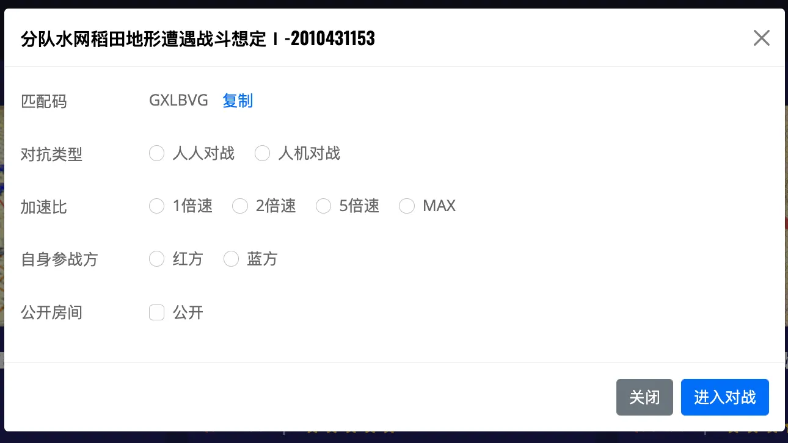

创建房间设置(a)

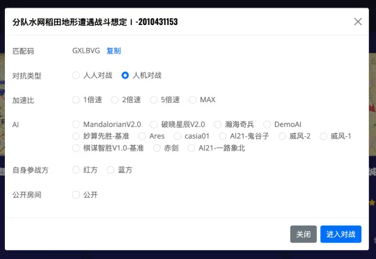

创建房间设置(b)

如图：

- **匹配码：**为6位房间编号匹配码，该匹配码可拷贝发送给他人，用户可使用匹配码，方式快速进入房间；
- **对抗类型：**分为“人人对战”和“人机对战”两种类型，选择“人机对战”，将出现对手智能体的选择，如图创建房间设置(b)所示；
- **加速比：**游戏时间加速设置，如选择2倍加速，即游戏时间1秒等同时钟时间0.5秒，系统默认加速比为1倍；
- **自身参战方：**选择自己在该轮对抗中执红还是执蓝；
- **是否公开房间：**选中“公开”，则本次建立的房间将出现在“公开房间”的列表中，其他用户可以通过公开房间的方式进入该房间对抗。

对于群队级对抗，房间创建者还需选择自己的推演身份：队长 或是 队员

群队级规模的比赛，通常建议由队长创建房间，将房间匹配码发送给自己的队友。人机混合对抗与普通群队创建房间流程一样。区别在于进入房间后，人机混合模式下营长增加了添加AI队员的操作步骤。

Note

- 群队房间创建者将房间匹配码发送给队友，队友使用匹配码查询并进入房间时，也需选择自己身份后进入对抗。
- 创建房间需要在2400秒时间内完成并进入比赛，否则系统将按照超时的异常，清除该未开启比赛的房间。

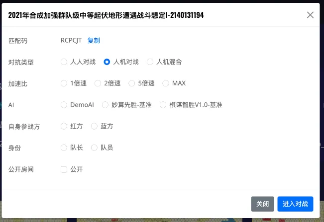

群队级对抗创建房间设置

## 进入比赛开展兵棋推演

点击上图“进入对抗”后，进入对抗界面，如下图所示。
其中，主要界面为推演盘面的态势呈现，可操作菜单主要区域包括：

- **菜单栏**：左上角菜单栏包含七个功能按钮，分别为：【通视地对地】，【通视空对地】，【通视空对空】，【军标符号】，【兵力编成】，【开始推演】，【退出】；
- **态势信息展示**：包括比分信息、历史裁决信息，以及下达的命令；
- **指令下达，武器选择区域**：部署、推演过程中，是控制算子进行推演的主要交互区域；
- **兵力编成树**：呈现当前属于己方的所有队员、队员控制的算子，可辅助导航到盘面的算子，也是营长群队和人机混合对抗时候，进行编组算子控制权分配的区域。

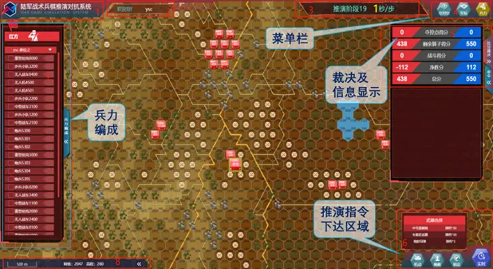

对抗系统主界面（红方视角）

界面中对自己控制和非自己控制的算子显示具有差异，属于自己控制的算子显示为双色，非自己控制的队友算子，显示为单色，如下图：

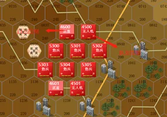

不同控制状态的算子呈现

### 兵棋推演过程概述

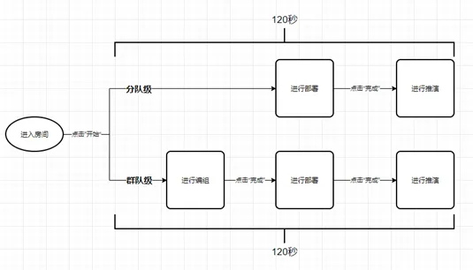

兵棋推演实施主要流程

兵棋推演过程主要包括：“战前编组”-“战前部署”-“推演对抗”三个阶段，如上图所示。其中，战前编组与部署限制操作的时长不得超过120秒，可通过点击“完成”按钮提前进入下一阶段。进行推演则需要推演的双方都点击“完成”确实开始推按，才会启动。
其中，分队级推演无编组阶段，将直接进入部署阶段。

### 开展兵棋推演

#### 启动推演

点击右上角“菜单栏”-“开始”按钮，此时推演引擎启动。

菜单栏

Note

群队级比赛中，只有队长可操作“开始”按钮，因此，群队级对抗需注意必须有队长进入房间，否则对抗是无法启动的。

#### 兵力编组

分队级对抗无编组阶段，将直接跳过本阶段进入“部署”的阶段。
群队级对抗中，营长席位具有“编组”权限，营长在本阶段通过“编组”指令将算子分配给相应的队友控制（在推演过程中，营长也可通过“编组”指令，转移算子的控制权，调配兵力）。

**编组方法**：在左侧“兵力编成”界面，通过复选框选中想要进行控制权调整的算子，右键菜单将选中的算子指派给对应的选手（包括AI），编组成功后右侧会显示编组成功弹出框。

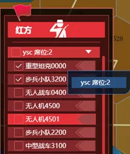

营长席位进行编组

#### 编组完成

营长席位完成编组指派后，需点击右上方菜单栏中“完成”按钮，结束编组阶段，进入“部署”阶段。

#### 战前部署

战前部署阶段允许推演人员操作由自己控制的算子，进行上下车部署（将于本阶段瞬间完成，不占用推演时间），同时也允许推演人员对自己控制的算子下达规划指令，规划指令将在推演计时开始后被逐步执行。
战前部署阶段操作右下方指令区。

#### 推演开始

对抗双方的所有选手点击部署“完成”按钮后，或是编组与部署时长到达120秒时，推演将自动开始。

#### 地图测量

系统右上角菜单栏提供【地面】、【超低空】、【低空】、【高空】四类观察的测量工具。

Info

观察是陆战兵棋的基本规则，包括是否通视、是否可观察，本工具还返回距离，以及影响通视的遮挡点

测量方法：
选择右上角功能按钮【测量】，选择测量类型后，左键在地图上点击，双击确认查看距离、高差、是否通视，可多次测量，右键取消测量，再次点击测量按钮，取消测量功能。也可通过键盘快捷键快速进入测量模式。如图所示：

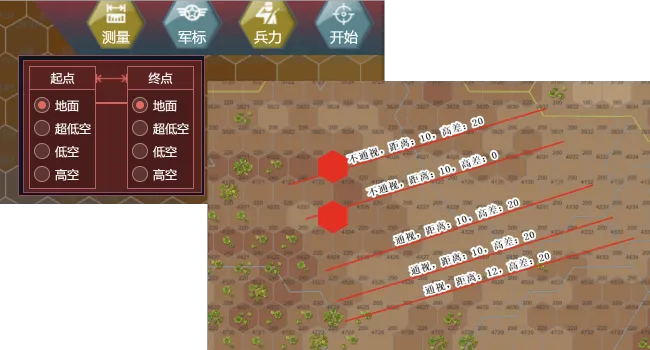

观察测量功能

#### 算子模型与棋子符号切换

系统提供算子模型和标记符号两种算子显示模式，可通过点击菜单栏切换【军标符号】和【模型符号】实现两种模型的切换。如图所示。

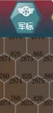

菜单栏

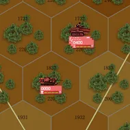

算子模型符号

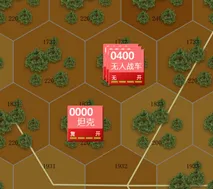

棋子标记符号

#### 实时指令与计划指令

系统提供了“实时”与“计划”两种指令下达，在战术级兵器中，两种指令内容一致，其差异在于：
计划指令有推演人员提前下达，进入指令队列，按队列排序逐一执行；
实时指令则为下达后立即执行的指令。
推演人员可根据需要和操作习惯，自由使用两种指令模式。

#### 算子进行机动

选中算子，鼠标左键点击指令区“机动”按钮后，在地图鼠标左键单击选择机动目的地，右键取消选择。
系统提供根据目的地以最短路径算法生成全路径的功能，双击弹出确认路径的对话框，并可在下拉框中选择机动结束后指令，点击确认后下达当前机动指令。推演人员也可根据自己的需求逐段或者逐格设置算子的路径。

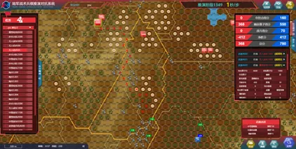

机动路径呈现

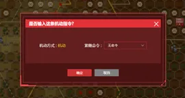

机动指令确认对话框

**行军：**选中在道路上的且处于控制状态下的算子，右键菜单选择“行军”后，算子进入行军状态，可沿道路快速机动，加快机动速度。行军后机动同机动，但要求武器必须为锁定状态，且路径必须沿道路。

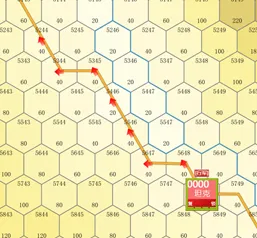
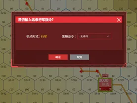

行军指令下达

#### 直瞄射击

实时指令区信息框中，如当前有算子可以实施打击，则会显示出“打击”按钮，点击“打击”按钮，选择目标算子和武器，即可实施对敌方算子的打击。打击完毕会显示损伤和状态信息。

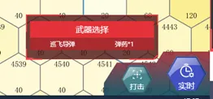
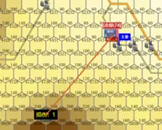

直瞄打击操作与打击操作呈现

#### 间瞄射击

选中间瞄射击后，鼠标左键在地图上选择攻击的位置，点击位置后，弹出确认框，下达指令。指令下达后，主界面上将呈现爆炸点。

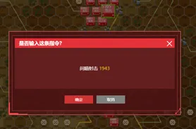
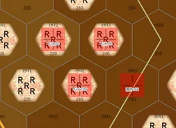

间瞄指令下达与呈现

#### 引导射击

实时指令区信息框中，如当前有算子可以实施引导射击，则会显示出“引导”按钮，点击“引导”按钮后，鼠标单击选择打击算子，弹出选择引导算子确认框，可进行选择引导算子，单击确认后下达引导指令。打击完毕会显示损伤和状态信息。
步兵、无人战车、无人机算子都可以引导射击，只可以引导携带导弹武器的算子。引导射击需要附近有可以被引导的算子以及敌方算子在被引导射击的算子攻击范围内。

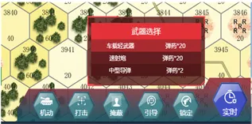
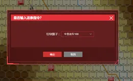

引导射击指令与选择引导算子框

#### 上下车

点击步兵算子，右键菜单可实施上车。完成上车后，对应车辆算子左下角会有数字标识，表示车上单位的数量。
下车指令，需点击搭载步兵的车辆算子，右键菜单或界面右下角会出现指令按钮区，选择要下车的算子的按钮，确认“下车”后，该算子下车，上下车均会需要75秒倒计时时间。

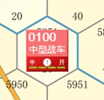
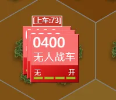

上下车状态呈现

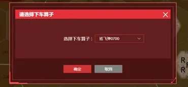

下车操作

#### 掩蔽

单击算子，在指令区中点击“掩蔽”按钮，算子即开始从正常状态转换成掩蔽状态，转换成功后，算子图标下方会显示“掩蔽”标记。下达其他移动的指令后移除掩蔽状态。

#### 夺控

算子满足夺控条件时，指令区将出现“夺控”按钮，即可夺控。夺控成功后，该夺控点旗帜颜色会变成夺控方的相同颜色。

#### 武器锁定和武器展开

控制算子后点击右下角的武器锁定状态，会解除武器的展开状态，进入锁定状态。控制算子后点击右下角的武器锁定状态，会解除武器的锁定状态，进入展开状态。

#### 冲锋状态切换

步兵可设置为冲锋状态，从而加快机动速度，鼠标单击步兵算子，在指令区点击【一级冲锋】或【二级冲锋】按钮，点击后步兵算子上会显示一级冲锋或二级冲锋，然后点击【机动】，规划机动路线后，步兵即可以冲锋的方式机动。

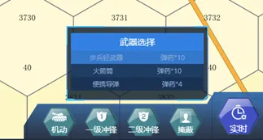
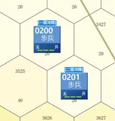

冲锋指令和冲锋状态

#### 在比赛过程中退出

如果比赛未开始，可点击退出，否则不可退出。比赛开始后，退出按钮隐藏，比赛结束后退出按钮出现，点击可返回主页面。

#### 地面算子解聚

地面算子具备解聚（区分兵力）操作，算子解聚时，该算子必须处于静止、未射击等行动状态（包括乘车、乘机、被压制等），鼠标单击算子，如果当前算子可进行“解聚”操作，指令区会显示“解聚”按钮，点击“解聚”按钮后，算子进入解聚，75秒后解聚完成，生成两个新算子，解聚模式为：4=2+2，3=2+1，2=1+1。

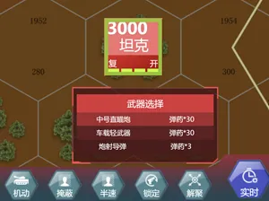

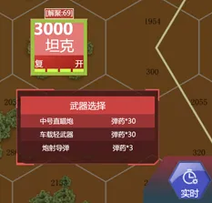

解聚指令和解聚状态

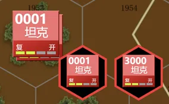

解聚后算子呈现

#### 地面算子聚合

地面算子具备聚合（整编兵力）操作，处于相同六角格内的两个同类型算子可进“聚合”操作，聚合的算子须处于静止、未射击等行动状态（包括乘车、乘机、被压制等），聚合后的总班数不得大于4。聚合动作只在两个算子上进行，可通过多轮聚合实现三个及以上算子的兵力整编。鼠标单击算子，如果具备“聚合”操作，指令区会显示“聚合按钮”，点击“聚合”按钮后，算子开始聚合，75秒后聚合完成，生成一个新算子。

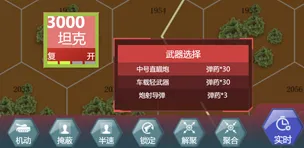

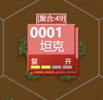

聚合指令和聚合状态

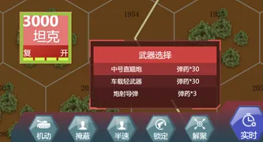

聚合后算子呈现

#### 改变空中算子高程

直升机滞空分“高空”、“低空”、“超低空”三种空中状态，三种状态分别按照所在六角格的高程上增加500米、200米、20米计算通视，高空与低空、超低空状态下射击战果和遭受打击战损修正不同，超低空状态下机动速度减半。鼠标单击直升机后，在指令区选择超低空或者高空，算子上方显示切换倒计时，75秒后，切换完成。

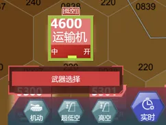

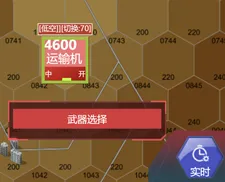

改变高程指令和状态呈现

#### 开启炮兵校射雷达

炮兵校射雷达，属车辆单位。开机工作后，已方炮火统一按照格内校射进行散布裁决。雷达车处于静止、未被压制状态下，可下达“开启雷达”指令，经75秒后雷达车处于开机状态。鼠标单击雷达算子，指令区选择“开启”按钮，75秒后开启完成，算子上方显示开启状态。

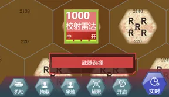

开启雷达指令和状态呈现

#### 进入工事，离开工事

工事的基本作用是为进入工事的人员或车辆提供隐蔽和防护。工事区分为人员工事和车辆工事两类，人员和车辆单位只能进入相应类型的工事（载人车辆按车辆处理，进入车辆工事）。如进入工事的人员或车辆车班数大于工事剩余容量，进入失败。鼠标单击选中算子，在指令区单击“进入工事”或“离开工事”，算子75秒后，“进入工事”或“离开工事完成”。

工事类型呈现

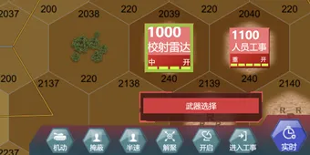

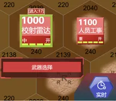

进入工事指令和状态呈现

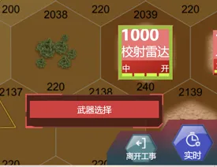

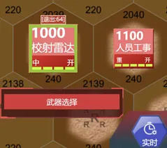

离开工事和状态呈现

#### 布雷

布雷车可在50格内进行“布雷”作业，雷场障碍对敌我双方均有效，未开辟雷场通路进入雷场六角格，会进行毁伤裁决。鼠标单击算子后，在指令区选择“布雷”后，鼠标左键在地图上选择铺设雷场的位置，选择位置后，弹出确认框，点击确认后，进入布雷状态，75秒完成1个雷场六角格的布设，最多可进行10次。

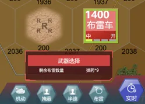

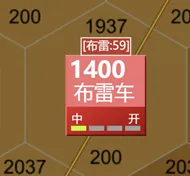

布雷指令和状态呈现

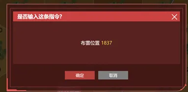

布雷确认框呈现

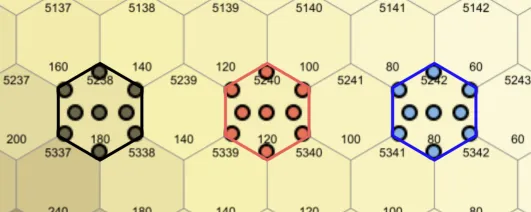

雷场阵营呈现

#### 半速机动

扫雷车以半速通过雷场六角格，完成雷场通路开辟。坦克算子以半速经过雷场六角格，可在雷场中开辟了通路。人员单位沿雷场通路通过雷场或车辆单位以半速沿雷场通路通过雷场不进行雷场毁伤裁决。鼠标单击扫雷车后，在指令区选择“半速”后，切换为“半速”状态。以“半速”状态通过雷场，可进行开辟通路。

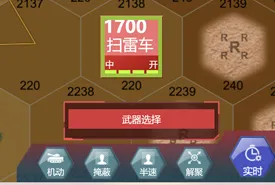

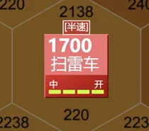

半速指令和状态呈现

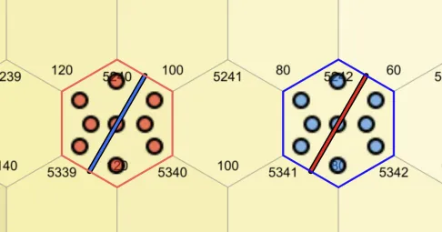

雷场通路呈现

#### 局部电子干扰

选中“电子干扰车”或“干扰小队”，点击“干扰”，在发起干扰的算子相邻格双击即可形成120度范围的干扰区域，双击区域为发起干扰方向的正前方。

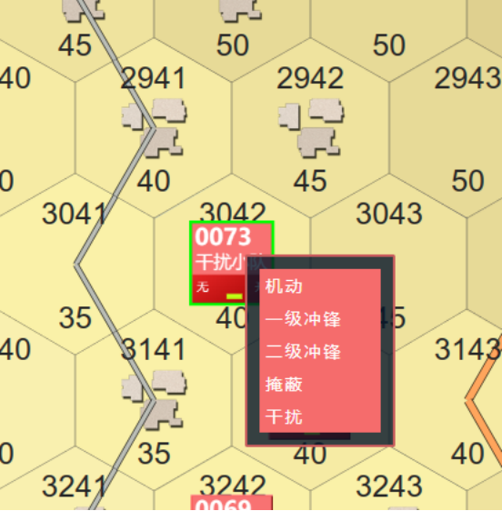

右键算子

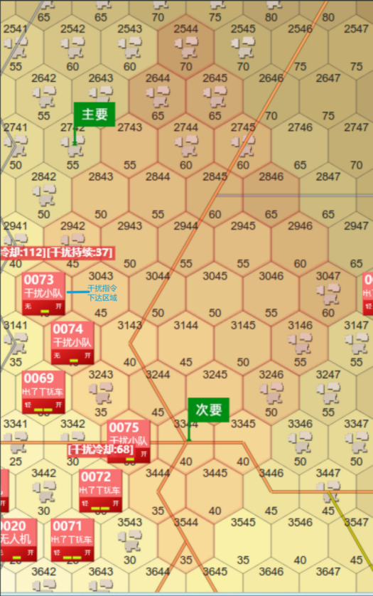

显示干扰范围

### 人机混合

人机混合对抗是指在群队级对抗中，对抗一方由推演人员和AI智能体共同组成。人机混合流程在群队对抗的基础上增加了营长席位选择AI的功能，以及营长席位向AI发送的任务级指令接口。其主要流程如图所示：

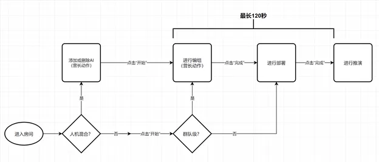

人机混合对抗流程

#### 添加和删除AI

营长席位在进入房间后，点击“开始”按钮前，通过在兵力编成菜单上右键选择并添加AI，同理，在AI名称右键选择踢出房间。

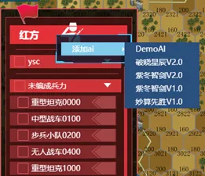

添加或删除AI

#### 下达任务

点击菜单任务按钮，弹出任务窗口，在任务窗口中选择编队，任务类型，目标位置，途径路线，步长后，选择执行，下达任务，单击加号添加多个任务。

向AI下达任务

#### 查看和调整任务

选择右侧任务菜单，弹出任务窗口，在该窗口中可查看已经下达的任务，并对其进行调整。

查看和调整AI任务