# 复盘系统

> 来源: https://wargame.ia.ac.cn/docs/tutorials/replay_system/

# 复盘系统

为了让开发者能有效观察所编写agent的表现，本平台提供了在线兵棋数据可视化的复盘系统。

## **主界面**

打开浏览器，输入服务器地址<http://wargame.ia.ac.cn/newReplay>。登录后右上角四个按钮，从左到右分别为：本地上传，视角切换，全局态势显示，兵力编成，符号切换。

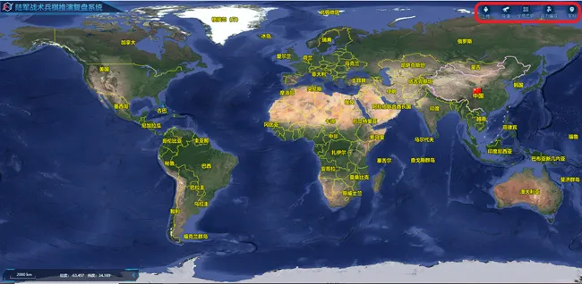

主界面展示

## **基本操作**

鼠标左键: 拖拽移动；鼠标右键及滚轮: 放大缩小；鼠标中键: 旋转。

## **本地上传**

点击右上角第一个按钮：本地上传。

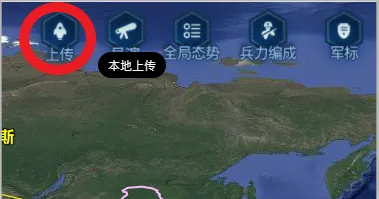

本地上传功能入口

弹出选择框如下图，选择对应的JSON复盘文件，选择后点击确定并打开。

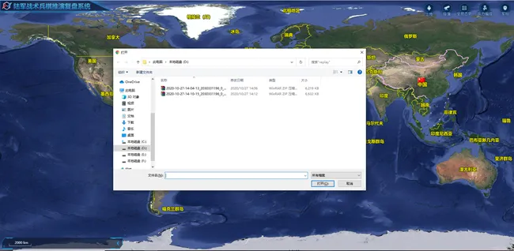

复盘JSON数据选择示意

数据加载完成后，页面效果如下

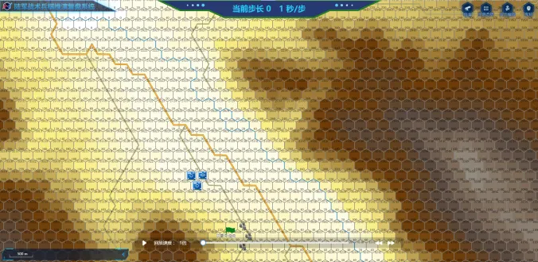

本地上传成功后展示页面

## **算子状态**

显示当前地图上所有算子信息，内容包括：算子ID，类型，分值，携带武器等信息。

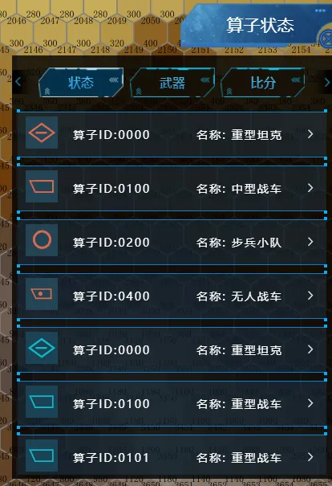

算子状态信息展示

## **武器信息**

选择某个算子后，武器信息中显示当前算子ID,和其所携带的武器。

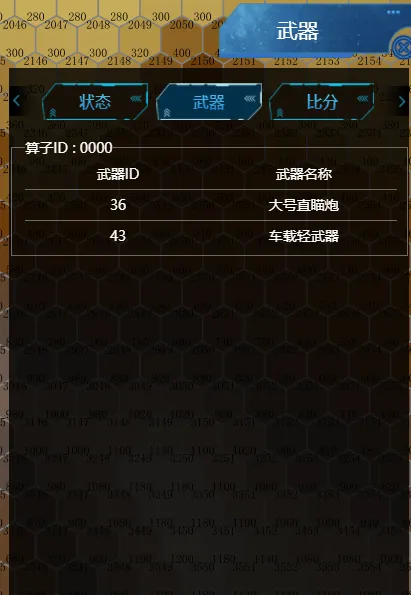

武器信息展示

## **比分**

比分为当前步长时的比分，包括：夺控分，剩余算子得分，战斗得分，净胜分，总分。

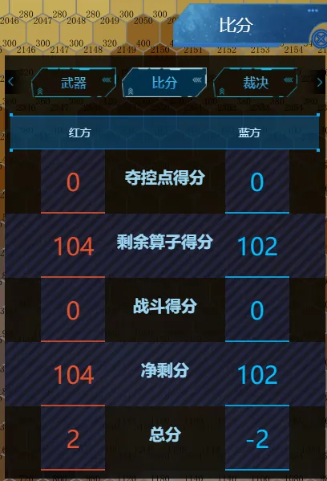

比分信息展示

## **裁决信息**

将前文裁决信息内容数据结构以表格形式展现，便于查看攻击后的战损/收益。

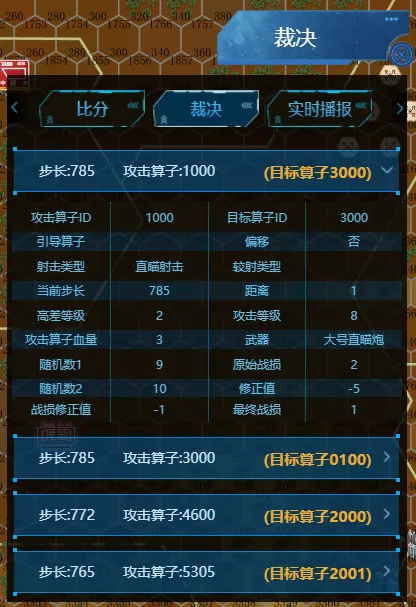

裁决信息展示

## **实时播报**

实时播报显示当前算子的动作类型等信息。

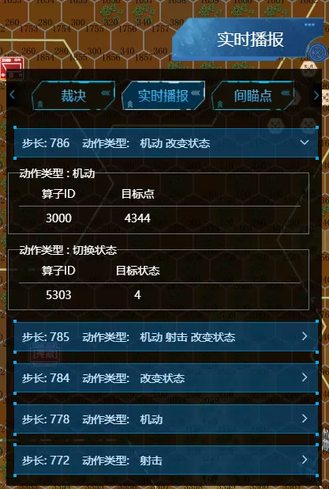

实时播报展示

## **间瞄点信息**

间瞄点信息显示当前步所有的攻击算子，攻击武器，位置，当前状态，飞行时间，爆炸时间。

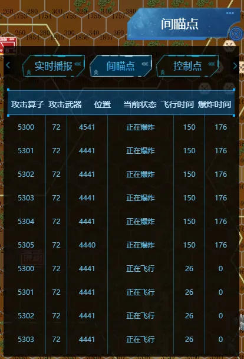

间瞄点信息展示

## **控制点**

显示地图上当前阵地的夺取情况和分值。

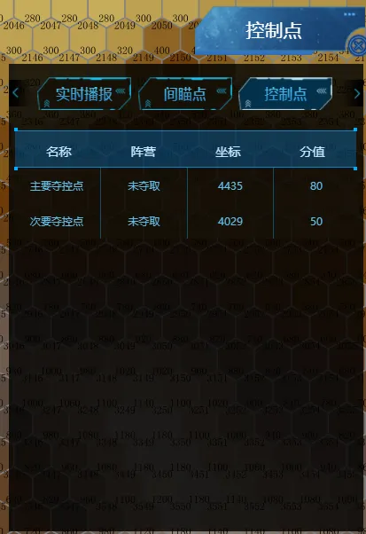

控制点信息展示

## **兵力编成**

兵力编成树上显示所有棋子的id和类型。
单击树上棋子时，会弹出当前棋子携带的武器信息；双击树上棋子时，会定位到地图棋子位置。

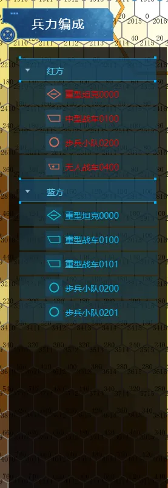

兵力编成信息展示

## **播放条**

可以进行播放，暂停，拖拽，上一帧，下一帧的查看，同时点击“1倍“”可以支持0.5 ~ 4倍速播放。

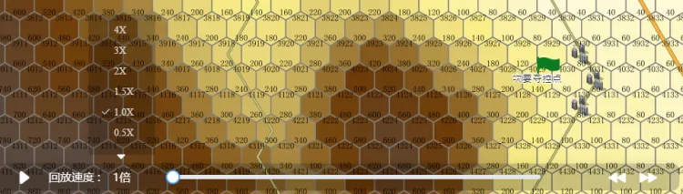

播放条控制展示

图 5-12 播放条控制展示

## **视角切换**

右上角可以进行红蓝导演三种视角切换，红、蓝都只能看到己方视野，导演两者可以看到全局视野。

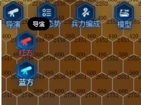

视角切换展示

## **符号切换**

可以将算子代表的符号进行切换，两种效果分别为图5-14和5-15。

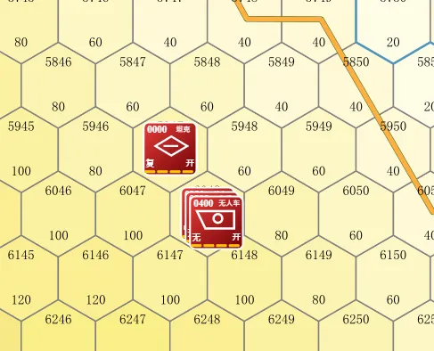

符号A

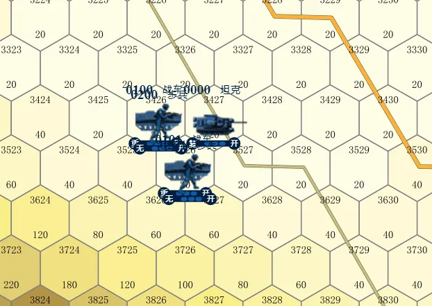

符号B