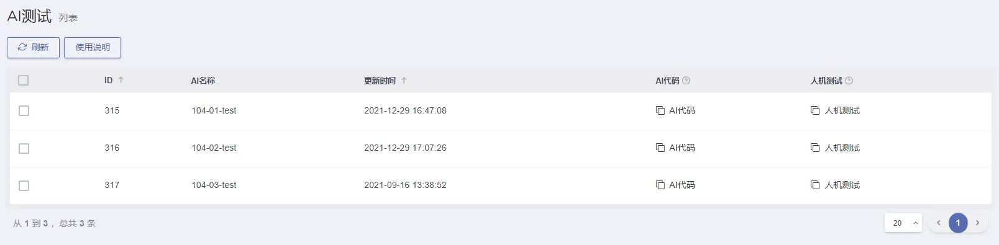
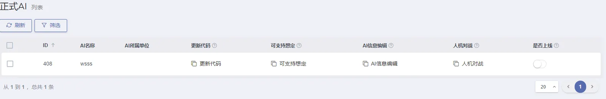
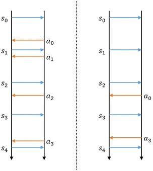

# 上传发布你的AI到平台

> 来源: https://wargame.ia.ac.cn/docs/tutorials/upload/

# **上传发布你的AI到平台**

AI上传地址

<http://wargame.ia.ac.cn/usercenter/aitest>

## **AI测试**

每人默认有三个AI测试位。各按钮功能如下：

- AI代码：可上传zip格式的AI代码，格式具体要求见[AI提交线上运行要求和方法](#upload)
- 日志及复盘下载：可下载机机测试的日志及复盘
- 人机测试：可与此测试位的AI进行人机对战。

## **正式AI**

正式AI为上线公开的AI，也作为参加比赛的AI。每人仅有一个。

Note

第一次上线正式AI需要点击新增按钮。填写AI名称，此名称不可修改。

各按钮功能如下

- 更新代码：可从三个测试位选择一个AI代码更新至此正式AI。
- 支持想定：选择正式AI支持的想定，当此AI上线后，可以在支持的想定下被其他用户选择对抗。
- AI信息编辑：填写AI所属单位等信息。
- 人机对战：可与此正式AI进行人机对战。
- 是否上线:：是否公开上线。

Info

正式位AI作为比赛用AI，无论是否声明了支持的想定，是否声明了公开，在参加已报名的比赛期间均会自动被系统调起参赛。

## **网络推演与内存推演的差异**

在单机训练版中，推演裁决引擎由run\_offline\_games.py推动。对抗推演的推进过程中，红蓝双方AI的决策与裁决是顺序串联的：在每一步中，环境会都等待双方决策，当红蓝都完成决策后，环境根据接收到的动作进行裁决向前推进。该设计是为了：

1. 按step推进，方便强化学习AI开展训练
2. 串联的执行方式支持AI调试过程中设置中断

但在网络对抗过程中，一场对抗的对局时长由加速比来确定，红蓝agent和裁决引擎是分布的3个独立进程，裁决引擎按照加速时钟独立推进，不会等待AI决策的动作，而是持续轮询，什么时候收到AI发来的动作，就什么时候裁决该动作。

举例来说：假设加速比为5，即裁决引擎的推进间隔为200ms。那么如果agent的决策时间加上态势与动作收发的网络延时在200ms以内，那么AI就能在每一帧都拿到态势进行决策，此时和单机训练版几乎无差别（如下图左图所示）。但如果计算时间长，超过了200ms，则和单机训练版相比会有两个区别：

1. 这次“缓慢”决策所生成的动作，到达裁决可能已经“过时”而裁决为“无效”
2. 在这次“缓慢”决策过程中，环境定时发出的逐帧态势到达，但agent正在决策计算中而消息被阻塞，当agent完成决策发出动作后，只会看到发出动作后再到达的新的态势，中间态势则看不到了（即“丢帧”）

如下图所示，由于*a0*动作决策时间长，*s1*和*s2*两帧态势agent无法获得。

## AI提交线上运行要求和方法

上传平台后的agent将使用CPU在以下python环境下运行(举办赛事或特别安排除外)，平台将保证这些库在线上运行时的可用性：

- python==3.10
- numpy==1.26.2
- pandas==1.5.3
- ray==2.9.0
- scikit-learn==1.0.2
- scipy==1.10.1
- tensorflow==2.11.0
- torch==2.0.1

提交agent时，请提供一个zip压缩包，压缩包中包含一个名为`ai`的`package`并确保可以从package中`import`名为`Agent`的类。具体做法参考以下步骤：将开发完成的`ai`文件夹（包含`ai`文件夹本身）压缩为ai.zip文件，确保压缩包内只有一个名为`ai`的文件夹，文件夹内有`agent.py`文件，`py`文件内有名为`Agent`的类。

AI上传地址

上传AI请前往<http://wargame.ia.ac.cn/usercenter/aitest>